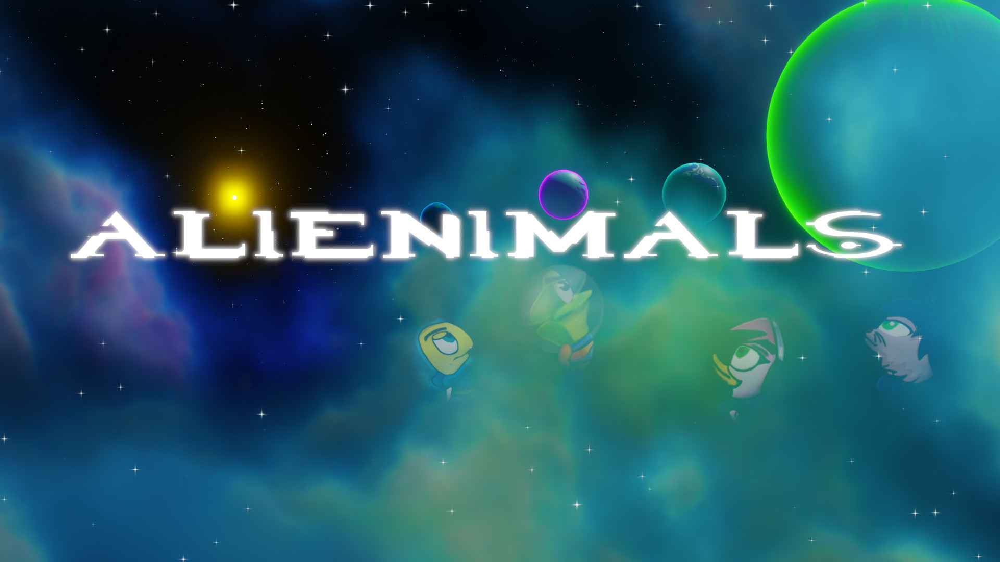
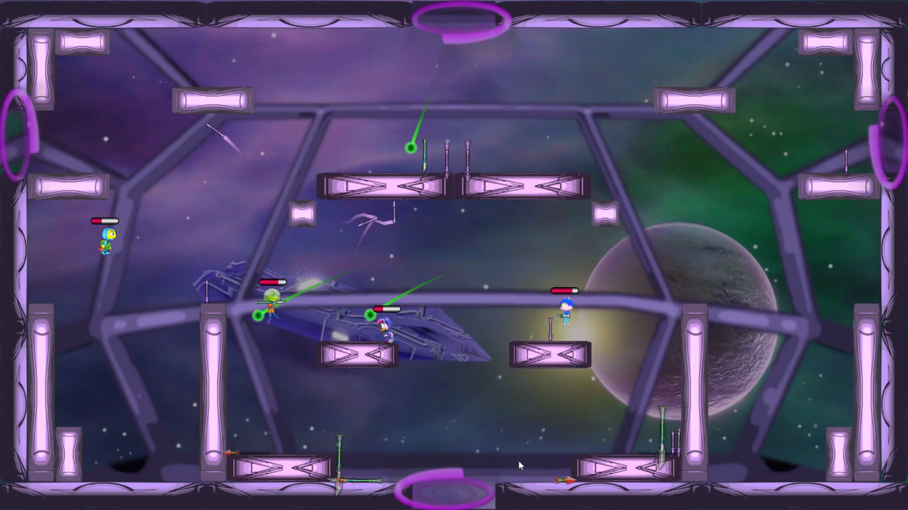
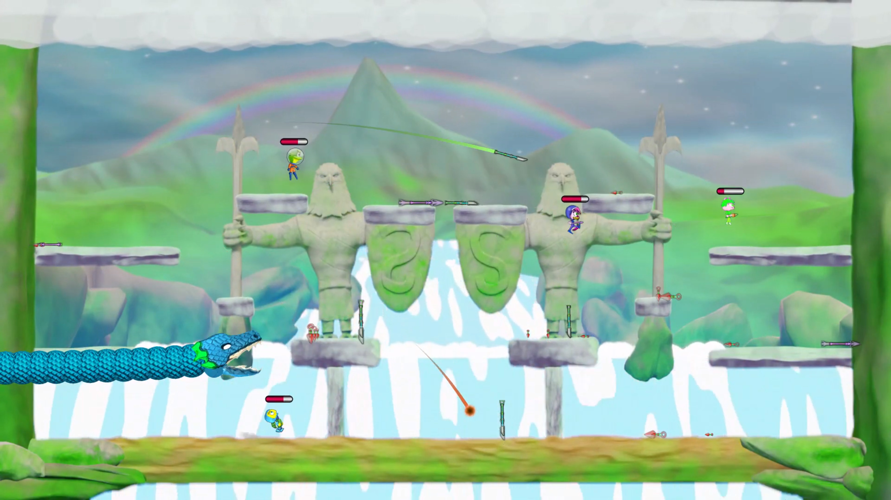

# Alienimals

* Jogo do gênero Plataforma
* Desenvolvido em Unity
* Toda a arte e animação de minha autoria, programação e som de terceiros.
* Destaques:
    * Arte 2.5D
    * Programas utilizados para a arte e animação: Blender, Krita, Gimp, Substance Designer, Davinci Resolve
    * Iluminação dinâmica 2D usando normal maps
    
* Instruções:
   * Executar o arquivo Alienimals.exe
   
* Imagens:

  
  
  
  
  
